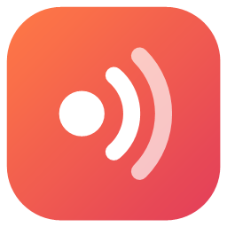
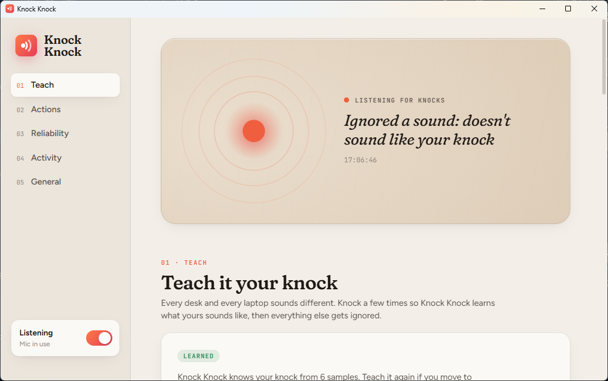

<p align="center">
  
</p>

<h1 align="center">Knock Knock</h1>

<p align="center">
  Knock on your desk to take a screenshot, or run anything else.<br>
  A tiny Windows tray app that listens for knocks through your laptop's microphone.
</p>

<p align="center">
  <a href="https://github.com/Ahd-Aljadeed/knock-knock/releases/latest"><strong>Download KnockKnock.exe</strong></a>
</p>



## What it does

| Knocks | Default action |
|---|---|
| 2 | Screenshot of screen 1 (all screens if you only have one) |
| 3 | Screenshot of screen 2 |
| 4 | Screenshot of all screens |

Each knock count (2 to 8) can run any of these instead:

- **Screenshot** of a chosen screen or all of them, saved as PNG and copied to the clipboard
- **Open** an app, file or website
- **Media keys**: play/pause, next/previous track, mute, volume
- **Keyboard shortcut**, sent to the active window
- **Lock the PC**
- **Run a command**

## Only real knocks

Desks get bumped, keyboards click and chairs thump. Knock Knock filters these out:

- **Teach your knock.** Knock 6 times and it learns what *your* knock sounds like on *your* desk (its tone and how fast it fades). Anything that sounds different is ignored.
- **Rhythm check.** Knocks must be evenly spaced and similarly strong.
- **Ignore while typing.** Nothing fires within a second of keyboard or touchpad use.
- **Ignore when you've been away.** After a few minutes without input, knocks are ignored until you touch the mouse or keyboard, so sitting down doesn't trigger anything.

The Activity panel shows every knock it acted on, and the reason it ignored the rest.

## Privacy

- Audio is analysed 10 ms at a time in memory to measure loudness and tone, then discarded. **Nothing is recorded, saved or sent anywhere.** The app contains no networking code.
- The microphone is **fully closed** while listening is off (tray menu or the switch in the window) and while your PC is locked. Windows' microphone indicator disappears when it's off.

## Install

1. Download `KnockKnock.exe` from the [latest release](https://github.com/Ahd-Aljadeed/knock-knock/releases/latest). It's a single file: no installer, no admin rights.
2. Run it. The settings window opens and Knock Knock adds itself to startup.
3. Click **Start teaching** and knock 6 times.

Requirements: Windows 10 or 11 with a built-in or USB microphone. The settings window uses the Microsoft Edge WebView2 Runtime, which is built into Windows 11 and most Windows 10 PCs.

> **"Windows protected your PC" or Smart App Control blocked it?** The .exe isn't code-signed yet, so Windows may warn about it. Choose *More info → Run anyway*. If Smart App Control blocks it outright, use [run from source](#run-from-source) instead. It runs the same code through Windows' own PowerShell.

Settings are stored in `%APPDATA%\KnockKnock\settings.json`. To uninstall, turn off *Start with Windows*, exit from the tray menu and delete the .exe.

## Run from source

You need Windows and [Node.js](https://nodejs.org/) 20 or newer. Nothing else: the C# compiler that ships with Windows (.NET Framework 4.8) builds the app.

```powershell
git clone https://github.com/Ahd-Aljadeed/knock-knock.git
cd knock-knock
powershell -ExecutionPolicy Bypass -File .\build.ps1          # builds dist\KnockKnock.exe
powershell -ExecutionPolicy Bypass -File .\tests\run-tests.ps1  # detection tests
```

To run without the .exe (for example when Smart App Control blocks it):

```powershell
powershell -ExecutionPolicy Bypass -File .\run-from-source.ps1
```

## How it works

```
mic (raw, any rate) ─► 16 kHz mono ─► 10 ms frames ─► knock detector ─► learned-knock match
                                                                              │
          action ◄─ binding for N knocks ◄─ typing / away / rhythm filters ◄─ sequencer (80-600 ms gaps)
```

| Path | What's there |
|---|---|
| `src/Audio.cs` | WASAPI capture in RAW mode (skips the driver's noise suppression) |
| `src/Detector.cs` | Knock detector, learned knock profile, sequencer, rhythm check |
| `src/Engine.cs` | Applies settings and filters, logs activity, fires actions |
| `src/Actions.cs` | Screenshot, open, media, hotkey, lock, command |
| `src/TrayApp.cs`, `src/SettingsWindow.cs` | Tray icon and the WebView2 settings window |
| `ui/` | The settings UI (React + TypeScript + Vite, built into one HTML file) |
| `tests/` | Synthetic recordings replayed through the detector |

## Contributing

Issues and pull requests are welcome. See [CONTRIBUTING.md](CONTRIBUTING.md).

## License

[MIT](LICENSE)
